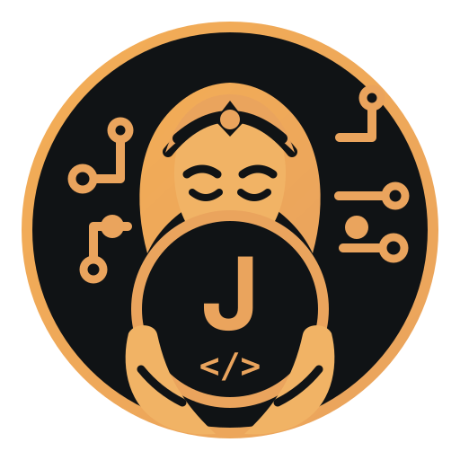

<p align="center">
  
</p>

# IDE Bridge

Your IDE has already read the project. It holds the symbol index, the type information, the
inspections and the refactoring engines — and an AI agent working in the same repository throws all
of that away and starts again with a text search.

IDE Bridge gives the agent the IDE's answers instead. A daemon speaks one protocol to a plugin
running inside IntelliJ, PyCharm, PhpStorm, GoLand or VS Code, and the agent asks through it: where
is this symbol used, what does the analyser say about this file, rename it across the project. Every
semantic answer comes from the IDE's own engines, over an authenticated loopback WebSocket. Nothing
leaves the machine, and nothing is guessed from the text.

**JUNON** is the ready-made consumer: ten `ide_*` tools composed onto an unmodified
[Serena](https://github.com/oraios/serena), so any MCP-capable agent — Claude Code, opencode,
Cursor — gets them without writing a client. Building your own instead means speaking IDEBP to the
daemon; the protocol is the contract, not JUNON.

### What that buys you, measured

- **Search that knows what a class is.** `query: "User", kinds: ["class"]` returns classes only, and
  the filter is applied by the IDE as results are collected — a rejected kind never spends the
  caller's limit. Without it, the same query also returns methods.
- **Edits you can read before they happen.** `refactor/prepare` returns a plan — every file it would
  touch, with `"guarantee": "semantic"` — and writes nothing; verified by hashing the files. Apply it
  and the response names what changed, with a token that undoes it.
- **A plan that went stale is refused, not applied.** Change the document in between and the
  **daemon** refuses `STALE_DOCUMENT` without ever forwarding the request, naming the revision to
  prepare against. That defect was live until 2026-08-14: stale edits were written and only then
  reported.

And the rule the whole thing is built on: **an answer says where it came from, and a refusal says
why.** No text search dressed up as a semantic query, no capability implied by silence, no
approximation standing in for an engine the IDE does not have. When PyCharm opens a project with no
interpreter, `diagnostics/getSnapshot` refuses `CAPABILITY_UNAVAILABLE` — it does not return an empty
list that reads like a clean bill of health.

## What it does today

| | |
| --- | --- |
| **Protocol** | 27 application methods, 16 routed to an IDE. JSON Schema 2020-12 is the contract; TypeScript is generated from it, never the reverse |
| **JetBrains adapter** | All 16. Run in IntelliJ, PhpStorm, GoLand and PyCharm — run, not merely measured compatible |
| **VS Code adapter** | 13 of 16. The three others are refusals with named reasons: no scoped undo, no TODO index, no bookmarks |
| **Serena integration** | JUNON — ten `ide_*` tools composed onto an unmodified Serena, including the IDE's own rename |
| **Tests** | 474 TypeScript — 54 of them the conformance suite, not a separate total — plus 287 Kotlin, 173 Python, and 9 VS Code host scenarios that drive a real editor |

[docs/STATUS.md](docs/STATUS.md) is the authority on what is verified, what is refused, what is
deferred, and — in its own section — the limits of the verification itself.
[docs/FINAL_REPORT.md](docs/FINAL_REPORT.md) is the summary with every validation command and its
real result.

## Architecture

```
Agent / MCP client
      │
      ▼
JUNON (Serena) or another integration
      │
      │  IDE Bridge Protocol — JSON-RPC 2.0 over WebSocket, 127.0.0.1 only, token-authenticated
      ▼
IDE Bridge daemon ──── CLI: daemon · status · adapters · workspaces · doctor
      │
      ├── VS Code adapter ────── VS Code APIs and whatever providers are installed
      │
      └── JetBrains adapter ──── PSI, indexes, native refactoring APIs
```

The daemon holds no opinion about languages. It routes, it validates that a request stays inside the
workspace it names, and it keeps the two-phase edit plans; every semantic answer comes from an IDE.

## Getting started

Node 24, pnpm 10, Python ≥ 3.12, and — for the JetBrains plugin — Gradle ≥ 9 with a JDK **21 or
newer**. The plugin is always emitted as Java 21 bytecode, whichever JDK builds it, because the
IDEs it has to load into are not all on the same one: PhpStorm 2025.3 still runs JBR 21 while
GoLand 2026.1 runs JBR 25.

```bash
pnpm install
pnpm -r build
```

**Start the daemon first** — adapters and consumers both connect to it, and it is the fixed point:

```bash
nohup node packages/cli/dist/bin.js daemon > ~/.ide-bridge/daemon.log 2>&1 &
```

It is a foreground server, hence the `&`: a shell that starts it plainly never gets its prompt back.
It writes its endpoint and token to `~/.ide-bridge/discovery.json`, mode `0600` — the path an IDE
reads when it was started normally, since a GUI application inherits nothing from your shell. Set
`IDE_BRIDGE_DISCOVERY_FILE` only to isolate a daemon, and then export it for the IDE too. From any
shell:

```bash
node packages/cli/dist/bin.js status
```

`adapterCount: 0` is the correct answer until an IDE connects — the daemon says so rather than
waiting for something to appear. Before trusting anything it reports, ask **which** daemon it is:

```bash
node packages/cli/dist/bin.js doctor
```

`doctor` names the process, its discovery file and its uptime alongside its verdict, and repeats
neither token nor endpoint. That is not decoration: a stale daemon passing every check is what once
cost this project three days of confident, wrong conclusions.

Then bring up an adapter — `cd jetbrains-plugin && ./gradlew runIde` (`runPyCharm`, `runGoLand`,
`runPhpStorm` also exist), or `cd packages/vscode-extension && pnpm test:integration`, which
downloads VS Code, installs the extension and drives the whole walkthrough itself.

To install into the IDEs you already use, one command does all of them:

```bash
scripts/install-jetbrains-plugin.sh          # --dry-run first, if you prefer
```

It builds the plugin if needed, installs it into every IDE on the machine whose build can run it, and
gives each one the plugin repository so it can announce future versions by itself. Then restart those
IDEs once — a plugin and a repository URL are both read at start-up, so an IDE running at that moment
has neither.

Doing it by hand is three steps per IDE, and the third — *Settings → Plugins → ⚙ → Manage Plugin
Repositories* → `https://raw.githubusercontent.com/Zall9/junon/main/dist/updatePlugins.xml` — is the
one that gets skipped, after which that IDE can never tell you a newer version exists.
[docs/RELEASING.md](docs/RELEASING.md) explains what is published and what it costs.

An IDE that has **not** been given it can still be told the halves are out of step, but only by
asking: `ide-bridge doctor`, whose `versions` check compares the daemon against every connected
plugin.
[docs/DEMO.md](docs/DEMO.md) is the step-by-step version, with the measured output of each step.

### Setting it up with a coding agent

If an agent is doing the setup — Claude Code, Cursor, or anything else that can run commands — point
it at **[docs/AGENT_SETUP.md](docs/AGENT_SETUP.md)** and let it work through that instead of this
section.

It is written for that reader: three processes that have to find each other, in order, each step
ending in a check to observe before moving on. It also names the failures that are silent by nature —
a daemon left over from an earlier session that passes every check, an IDE reading a different
discovery file, a host configured for `serena` rather than `junon` — with the command that tells them
apart, and the rules the agent is not free to relax.

It ends with the step that is easy to skip: **making the agent use any of it.** Measured on one
search agent over 332 sessions — 12 332 tool calls, 6 609 of them `read` — while its prompt said not
to. Instructions lose to the tool that is closer, so the fix is to remove the tool rather than repeat
the sentence.

### Connecting Serena



JUNON installs **into** Serena's own environment, because it imports it:

```bash
pipx inject serena-agent integrations/serena --include-apps
```

Then point your agent host at `junon`, never at `serena` — the latter still starts plain Serena, on
purpose, and that failure is silent. [integrations/serena/README.md](integrations/serena/README.md)
covers the other install shapes, how to check the composition took, and why the separation exists.

## Layout

```
packages/protocol/          JSON Schema wire contracts, generated types, Ajv validation
packages/bridge-daemon/     The daemon: transport, sessions, routing, plans, discovery, dashboard
packages/bridge-client/     Shared TypeScript client: discovery, auth, typed RPC, reconnection
packages/cli/               ide-bridge — daemon, status, adapters, workspaces, doctor
packages/vscode-extension/  VS Code adapter
packages/conformance/       One rule set judging both adapters from captured runs
jetbrains-plugin/           JetBrains adapter (Kotlin, IntelliJ Platform)
integrations/serena/        JUNON — the Serena composition
examples/                   Deterministic fixture projects the demos and tests run against
scripts/                    Fixture validation and type generation
docs/                       See below
```

Every source directory carries a `codemap.md` describing what is in it;
[codemap.md](codemap.md) is the atlas over them.

## Security

The rules below are constraints on the design, not settings:

- The daemon binds **loopback only** (`127.0.0.1`/`::1`) and is never exposed publicly.
- Authentication tokens are ≥ 256 bits from a CSPRNG, compared in constant time. The discovery file
  is `0600`, written atomically, and read with `O_NOFOLLOW` and an owner check.
- **No method executes a shell command or evaluates code**, in any IDE.
- No file outside a declared workspace root is reachable, and workspace trust is never silently
  disabled.
- Secrets, full file contents and full replacement text are never logged.

[docs/SECURITY.md](docs/SECURITY.md) states the model and its boundaries.

## Validation

```bash
pnpm format:check && pnpm lint && pnpm typecheck && pnpm test
pnpm protocol:generate:check    # fails if the generated types drift from the schemas
cd jetbrains-plugin && ./gradlew test
cd integrations/serena && python3 -m pytest
```

A green suite is not the standard used here. A guarantee is trusted once **breaking it on purpose
makes a test fail** — several tests in this repository exist because a mutation showed the previous
one asserted nothing.

## Documentation

| | |
| --- | --- |
| [docs/ARCHITECTURE.md](docs/ARCHITECTURE.md) | How the pieces fit and why the boundaries fall where they do |
| [docs/PROTOCOL.md](docs/PROTOCOL.md) | The wire contract, method by method |
| [docs/SECURITY.md](docs/SECURITY.md) | Threat model, trust boundaries, what is deliberately impossible |
| [docs/STATUS.md](docs/STATUS.md) | What is verified, what is not, and how it was measured |
| [docs/AGENT_SETUP.md](docs/AGENT_SETUP.md) | Ordered setup for a coding agent: what to run, what to check, what fails silently |
| [docs/DEMO.md](docs/DEMO.md) | Reproducible walkthrough per adapter, with real output |
| [docs/FINAL_REPORT.md](docs/FINAL_REPORT.md) | The summary: architecture, results, remaining risks at full strength |
| [CHANGELOG.md](CHANGELOG.md) | What changed per release, and what you have to do about it |
| [docs/RELEASING.md](docs/RELEASING.md) | Cutting a release, and the three ways anyone learns one exists |
| [docs/REMOTE_DEVELOPMENT.md](docs/REMOTE_DEVELOPMENT.md) | Remote and containerised setups |
| [docs/adr/](docs/adr/) | 39 decision records, including the refactorings that were refused |

`TASK.md` is the authoritative product scope; `AGENTS.md` holds the development rules.

## License

Apache-2.0 — see [LICENSE](./LICENSE).
